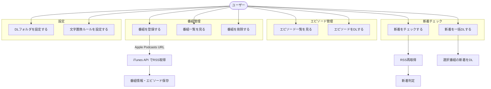

# 要件定義書

## 1. プロジェクト概要

### 1.1 アプリケーション名

Podcast Downloader（仮称）

### 1.2 目的・背景

Podcast の音声ファイルをローカルにダウンロードし、オフライン環境で任意のプレイヤーで再生するための専用ツール。既存の Podcast アプリに依存せず、ダウンロード管理に特化したシンプルなデスクトップアプリケーションを提供する。

### 1.3 対象ユーザー

- 個人利用（利用者は開発者本人のみ）

### 1.4 対象プラットフォーム

- **主要ターゲット**: Windows 11
- **開発環境**: macOS
- **設計方針**: クロスプラットフォームへの拡張を容易にする設計とする

## 2. 技術スタック

| カテゴリ | 技術 |
|---------|------|
| アプリケーションフレームワーク | Tauri v2 |
| バックエンド言語 | Rust |
| フロントエンドフレームワーク | React |
| フロントエンド言語 | TypeScript |
| ビルドツール | Vite |
| データベース | SQLite（rusqlite） |
| パッケージマネージャー | pnpm |
| バージョン管理（Node.js） | mise |
| バージョン管理（Rust） | rustup |
| CI/CD | GitHub Actions |

## 3. 機能要件

### 3.1 番組管理

#### FR-001: 番組登録

- Apple Podcasts の Web ページ URL を入力して番組を登録できる
- アプリは URL から Podcast ID を抽出し、iTunes Lookup API を使用して RSS フィード URL を取得する
- RSS フィードを解析し、番組情報（タイトル、制作者、説明、アートワーク等）を保存する
- 登録時にRSS フィード内の全エピソード情報を取得・保存する

#### FR-002: 番組一覧表示

- 登録済みの番組を一覧で表示できる
- 各番組について、タイトル、アートワーク、新着エピソードの有無を表示する

#### FR-003: 番組削除

- 登録済みの番組を削除できる
- 番組削除時に関連するエピソード情報も削除する（CASCADE 削除）

### 3.2 エピソード管理

#### FR-004: エピソード一覧表示

- 番組を選択すると、その番組のエピソード一覧を表示できる
- 各エピソードについて、タイトル、配信日、ダウンロード状態を表示する

#### FR-005: 個別エピソードダウンロード

- エピソード一覧から個別のエピソードを選択してダウンロードできる
- ダウンロード済みのエピソードであっても個別ダウンロードは実行可能とする（再ダウンロード）
- ダウンロード中は進捗状況を表示する
- ダウンロード失敗時はエラーメッセージを表示する。自動リトライは行わず、ユーザーが再操作する

#### FR-006: ダウンロード状態の永続管理

- ダウンロードが完了したエピソードの状態をデータベースに記録する（episodes.downloaded_at）
- ダウンロード済みファイルをファイルシステムから削除しても、ダウンロード済みの記録は保持する

### 3.3 新着チェック

#### FR-007: 新着エピソードの判定

- 番組の RSS フィードを再取得し、新着エピソードを判定する
- **新着の定義**: 当該番組で最後にダウンロードしたエピソードの配信日以降に配信された、未ダウンロードのエピソード
- 一度もダウンロードしていない番組の場合、全エピソードを新着として扱う

#### FR-008: 新着番組の表示

- 新着エピソードが存在する番組を視覚的に区別して表示する（バッジ等）

#### FR-009: 番組単位の新着一括ダウンロード

- 特定の番組を選択し、その番組の新着エピソードを一括でダウンロードできる

#### FR-010: 複数番組の新着一括ダウンロード

- 複数の番組を選択し、選択した番組の新着エピソードをまとめて一括ダウンロードできる

### 3.4 ファイル管理

#### FR-011: ダウンロードフォルダの設定

- ダウンロード先のベースフォルダを任意のパスに設定できる

#### FR-012: 番組別サブフォルダの自動作成

- ダウンロード時に、ベースフォルダ内に番組名のサブフォルダを自動作成し、その中にファイルを保存する

#### FR-013: ファイル名・フォルダ名の文字置換

- ファイル名およびフォルダ名に使用できない文字や、置換したい文字のルールを設定できる
- 置換ルールは以下の形式で設定する:
  - **個別指定**: 置換前の文字列と置換後の文字列のペアを複数登録できる（例: `/` → `-`）
  - **フォールバック**: 個別指定に該当しない禁止文字に対する一括置換文字を指定できる
- 置換ルールには適用順序を設定できる

### 3.5 設定

#### FR-014: 設定の永続化

- 以下の設定を JSON ファイル（tauri-plugin-store）に保存し、アプリ再起動後も維持する:
  - ダウンロード先フォルダのパス
  - 文字置換ルール
  - フォールバック置換文字

## 4. 非機能要件

### 4.1 パフォーマンス

- NFR-001: ダウンロードは非同期で実行し、UI をブロックしない
- NFR-002: 複数エピソードの一括ダウンロード時は逐次実行とする（並行ダウンロードは不要）

### 4.2 セキュリティ

- NFR-003: Tauri の capabilities 設定により、アプリに必要な最小限の権限のみを付与する
- NFR-004: 外部 URL へのアクセスは RSS フィード取得および音声ファイルダウンロードに限定する

### 4.3 保守性

- NFR-005: バックエンド（Rust）とフロントエンド（React）を明確に分離し、モジュラーな設計とする
- NFR-006: 設計ドキュメントを整備し、スクラップ＆ビルドが可能な状態を維持する

### 4.4 拡張性

- NFR-007: 番組登録ソースの追加（RSS URL 直接入力等）を容易に行える設計とする
- NFR-008: クロスプラットフォーム対応への拡張が最小限の変更で可能な設計とする

### 4.5 CI/CD

- NFR-009: GitHub Actions でビルド、Lint、テストを自動実行する
- NFR-010: GitHub Actions で Windows 向けインストーラーを自動生成し、GitHub Releases でリリースする
- NFR-011: CI で実行するすべての検証をローカルでも実行可能とする

## 5. ユースケース概要

## 6. スコープ外

以下の機能は本アプリのスコープ外とする。

- 音声の再生機能
- マルチユーザー対応
- クラウド同期・バックアップ
- Apple Podcasts 以外のプラットフォーム URL からの登録（将来的な拡張として設計上は考慮）
- Podcast の検索機能（URL の直接入力による登録のみ）
- エピソードの自動定期ダウンロード（手動操作を前提とする）

## 7. 用語集

| 用語 | 説明 |
|------|------|
| 番組 (Podcast) | RSS フィードで配信される一連のエピソードの集合。チャンネルとも呼ばれる |
| エピソード (Episode) | 番組内の個別の音声コンテンツ。1つの音声ファイルに対応する |
| RSS フィード | 番組情報とエピソード一覧を含む XML ファイル。Podcast の標準的な配信形式 |
| 新着エピソード | 最後にダウンロードしたエピソードの配信日以降に配信された未ダウンロードのエピソード |
| iTunes Lookup API | Apple が公開している Podcast 情報検索 API。Podcast ID から RSS フィード URL を取得できる |
| DL 済み | ダウンロードが完了し、履歴に記録されている状態。ファイルの存在有無は問わない |
| 文字置換ルール | ファイル名・フォルダ名に使用できない文字を別の文字に変換するための設定 |
| フォールバック置換 | 個別の置換ルールに該当しない禁止文字に対して適用されるデフォルトの置換文字 |
