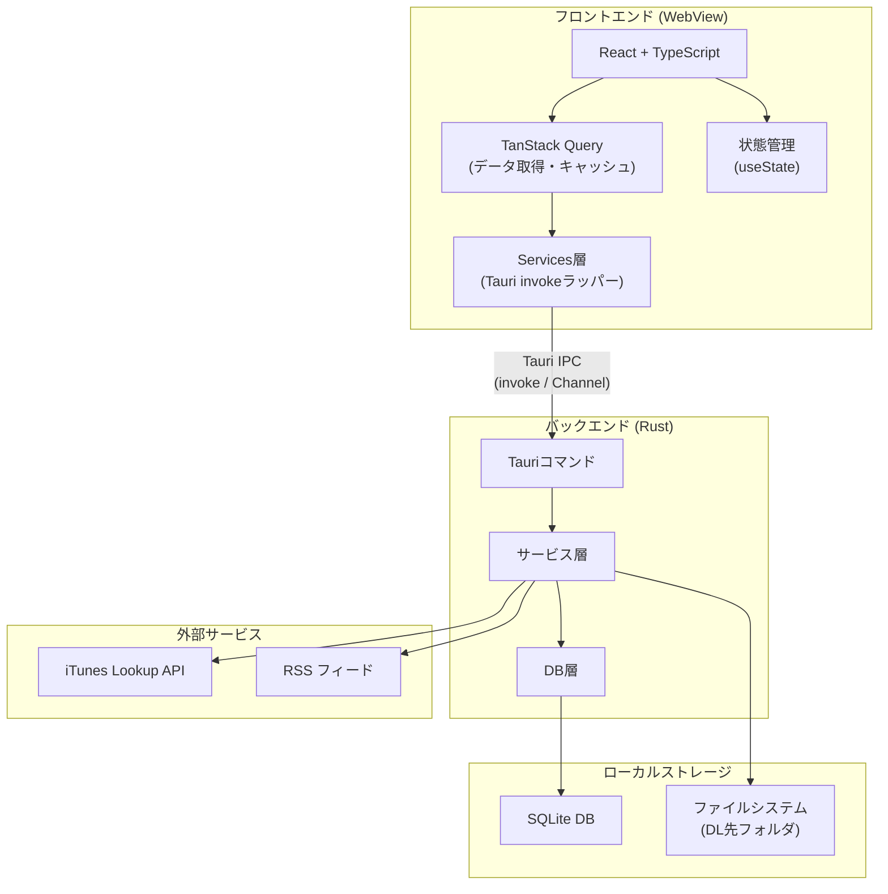
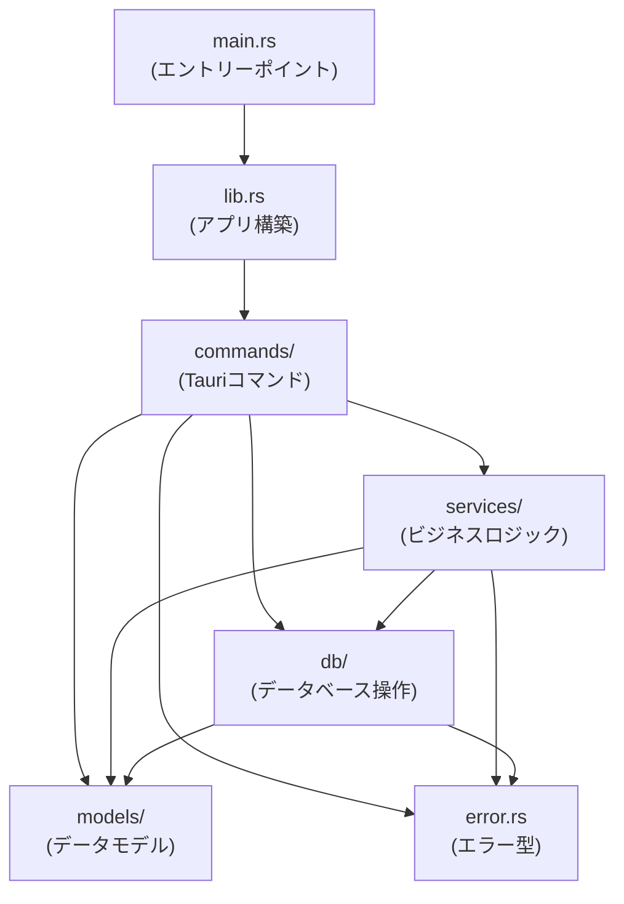
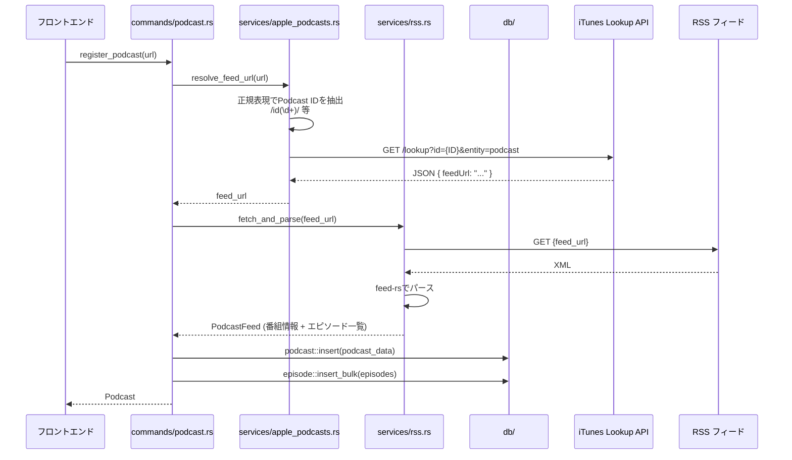
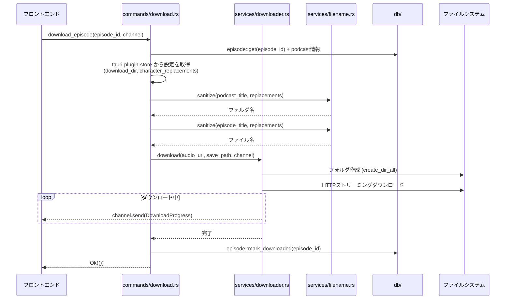
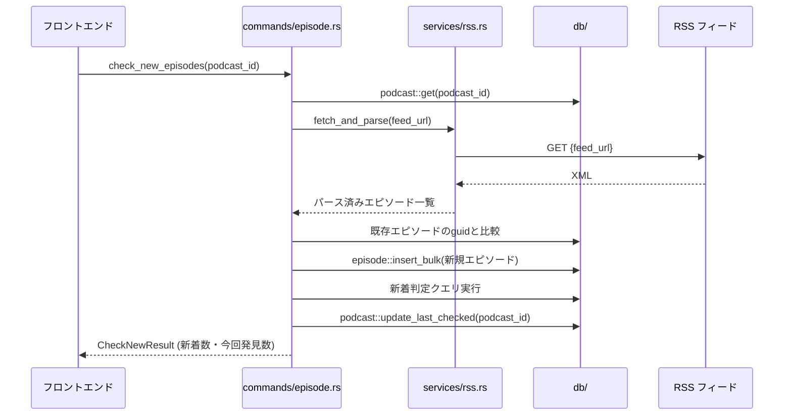
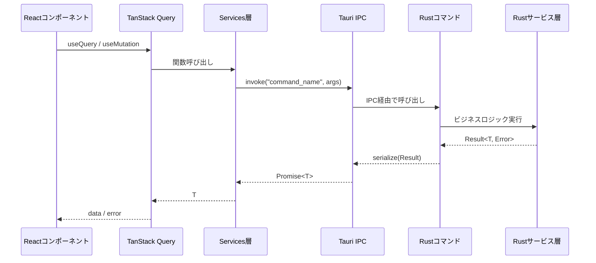
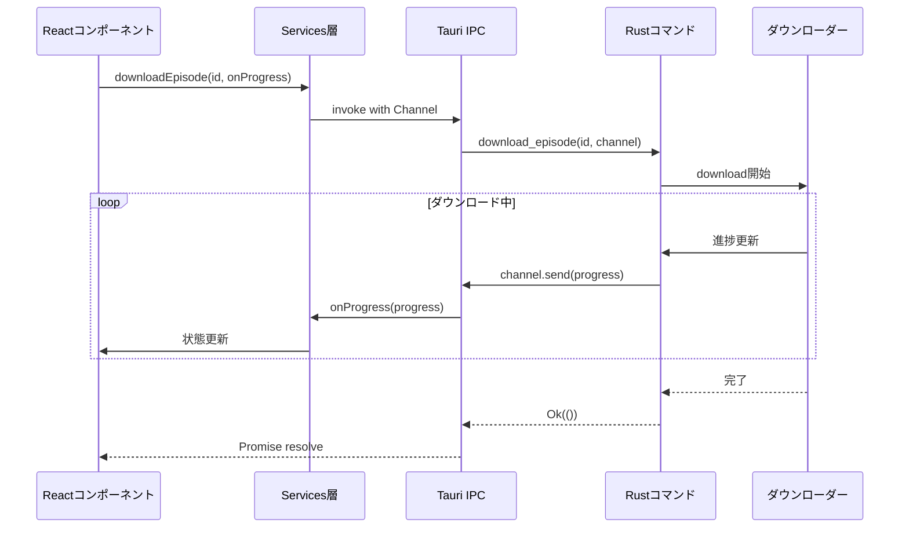

# アーキテクチャ設計書

## 1. 全体アーキテクチャ

Tauri v2 のアーキテクチャに基づき、フロントエンド（WebView）とバックエンド（Rust）を IPC で接続する構成とする。



## 2. プロジェクトディレクトリ構造

```
podcast-downloader/
├── docs/                           # 設計ドキュメント
│   └── decisions/                  # 設計判断記録（ADR）
├── src/                            # フロントエンド (React + TypeScript)
│   ├── components/                 # UIコンポーネント（common/podcast/episode/settings）
│   ├── hooks/                      # カスタムフック（TanStack Query ラッパー）
│   ├── pages/                      # ページコンポーネント
│   ├── services/                   # Tauri invoke ラッパー
│   ├── types/                      # TypeScript 型定義
│   └── utils/                      # ユーティリティ関数
├── src-tauri/                      # バックエンド (Rust)
│   ├── src/
│   │   ├── commands/               # Tauri コマンド定義（番組・エピソード・DL・設定）
│   │   │   └── test_helpers.rs     # テスト用共通ユーティリティ（モック等）
│   │   ├── services/               # ビジネスロジック
│   │   │   ├── traits.rs           # サービス層の trait 定義（ADR-012）
│   │   │   └── real.rs             # trait の本番実装
│   │   ├── db/                     # データベース操作（CRUD・マイグレーション）
│   │   ├── models/                 # データモデル（Serialize/Deserialize）
│   │   ├── error.rs                # エラー型定義
│   │   └── lib.rs                  # アプリ構築・コマンド登録
│   ├── migrations/                 # SQL マイグレーションファイル
│   ├── capabilities/               # Tauri 権限設定
│   ├── Cargo.toml
│   └── tauri.conf.json
├── .github/
│   └── workflows/
│       ├── ci.yml                  # Lint・テスト
│       └── release.yml             # ビルド・リリース
├── package.json
├── pnpm-lock.yaml
├── tsconfig.json
├── vite.config.ts
├── .mise.toml                      # Node.js バージョン固定（ローカル開発用）
└── .node-version                   # Node.js バージョン固定（CI 用）
```

## 3. バックエンド設計 (Rust)

### 3.1 アプリ初期化フロー

`lib.rs` でアプリ起動時に以下を実行する。

1. **DB 接続**: `$APPDATA/podcast-downloader/` に SQLite DB ファイルを作成・接続
2. **マイグレーション実行**: `rusqlite_migration` でスキーマを最新バージョンに更新
3. **サービスコンテナ登録**: `ServiceContainer`（trait 実装群）を Tauri の managed state に登録
4. **Tauri コマンド登録・アプリ起動**: 全コマンドを登録し、WebView を起動

> **設定の初期化**: tauri-plugin-store の設定ファイルは初回 `get_settings` 呼び出し時に `Default::default()` で遅延生成される。明示的な初期化処理は行わない。

### 3.2 モジュール依存関係



各層の責務:

| 層 | 責務 | 依存先 |
|---|------|-------|
| commands/ | フロントエンドからの IPC リクエストの受付。引数のバリデーション。サービス層・DB 層の呼び出し | services/, db/, models/, error |
| services/ | ビジネスロジックの実装。外部 API 通信、ファイル操作 | db/, models/, error |
| db/ | SQLite への CRUD 操作。マイグレーション管理 | models/, error |
| models/ | データ構造の定義。Serialize/Deserialize 実装 | なし |
| error | アプリ共通のエラー型。各層のエラーを統合 | なし |

### 3.3 Tauri コマンド一覧

#### 番組関連

| コマンド名 | 引数 | 戻り値 | 説明 |
|-----------|------|--------|------|
| `register_podcast` | `url: String` | `Result<Podcast, Error>` | Apple Podcasts URL から番組を登録 |
| `list_podcasts` | なし | `Result<Vec<PodcastSummary>, Error>` | 番組一覧取得（新着数を含む） |
| `delete_podcast` | `podcast_id: i64` | `Result<(), Error>` | 番組を削除 |

#### エピソード関連

| コマンド名 | 引数 | 戻り値 | 説明 |
|-----------|------|--------|------|
| `list_episodes` | `podcast_id: i64` | `Result<Vec<Episode>, Error>` | エピソード一覧取得（DL状態を含む） |
| `check_new_episodes` | `podcast_id: i64` | `Result<CheckNewResult, Error>` | 新着チェック（新着数・今回発見数を返す） |
| `check_all_new` | なし | `Result<Vec<PodcastNewCount>, Error>` | 全番組の RSS を再取得し新着状況を返す |

#### ダウンロード関連

| コマンド名 | 引数 | 戻り値 | 説明 |
|-----------|------|--------|------|
| `download_episode` | `episode_id: i64, on_progress: Channel<DownloadProgress>` | `Result<(), Error>` | エピソードをダウンロード（進捗通知付き） |
| `batch_download_new` | `podcast_ids: Vec<i64>, on_progress: Channel<BatchDownloadProgress>` | `Result<(), Error>` | 選択番組の新着を一括ダウンロード（逐次実行） |

#### 設定関連

| コマンド名 | 引数 | 戻り値 | 説明 |
|-----------|------|--------|------|
| `get_settings` | なし | `Result<AppSettings, Error>` | 全設定を取得（tauri-plugin-store） |
| `update_settings` | `settings: AppSettings` | `Result<(), Error>` | 設定を保存（tauri-plugin-store） |
| `select_folder` | なし | `Result<Option<String>, Error>` | フォルダ選択ダイアログを表示 |

### 3.4 Apple Podcasts 登録フロー



### 3.5 ダウンロードフロー

個別ダウンロード（`download_episode`）はダウンロード済みかどうかを問わず実行可能とする（再ダウンロード対応）。一括ダウンロード（`batch_download_new`）では未ダウンロードの新着エピソードのみを対象とする。



### 3.6 ファイル命名規則

ダウンロードファイルのパスは以下の形式とする。

```
{download_dir}/{sanitized_podcast_title}/{published_date}_{sanitized_episode_title}.{ext}
```

- `published_date`: エピソードの配信日（`YYYY-MM-DD` 形式）
- `ext`: 音声 URL から取得した拡張子（例: `mp3`, `m4a`）
- サニタイズ処理: 文字置換ルールを適用し、OS 禁止文字を除去する

### 3.7 新着チェックフロー



### 3.8 使用クレート一覧

| クレート | 用途 |
|---------|------|
| tauri | アプリケーションフレームワーク |
| serde / serde_json | シリアライゼーション / デシリアライゼーション |
| reqwest | HTTP クライアント（iTunes API, RSS取得, ダウンロード） |
| feed-rs | RSS / Atom フィードのパース |
| rusqlite | SQLite データベースアクセス |
| rusqlite_migration | データベースマイグレーション管理 |
| tokio | 非同期ランタイム（Tauri v2 が使用） |
| chrono | 日時処理 |
| regex | 正規表現（URL からの ID 抽出等） |
| thiserror | エラー型の定義 |
| async-trait | サービス trait の非同期メソッド定義（ADR-012） |
| tauri-plugin-store | アプリ設定の永続化（JSON ファイル） |
| tauri-plugin-dialog | フォルダ選択ダイアログ |
| log / env_logger | ログ出力 |

## 4. フロントエンド設計 (React + TypeScript)

### 4.1 ページ構成

ルーティングには React Router を使用する。

| ページ | パス | 説明 |
|-------|------|------|
| 番組一覧 | `/` | メイン画面。登録済み番組の一覧 |
| エピソード一覧 | `/podcast/:id` | 番組のエピソード一覧 |
| 設定 | `/settings` | アプリケーション設定 |

### 4.2 状態管理方針

| 状態の種類 | 管理方法 | 用途 |
|-----------|---------|------|
| サーバー状態 | TanStack Query | 番組一覧、エピソード一覧など DB から取得するデータ |
| UI 状態 | useState | ダイアログ表示フラグ、フォーム入力値、ダウンロード進捗など |

画面数が少なくコンポーネント階層が浅いため、グローバル状態管理ライブラリは導入せず useState + props で管理する。

### 4.3 Services 層（Tauri invoke ラッパー）

フロントエンドから Rust バックエンドの Tauri コマンドを呼び出す型安全なラッパー関数群を `src/services/` に配置する。

```typescript
// src/services/podcast.ts の例
import { invoke } from "@tauri-apps/api/core";
import type { Podcast, PodcastSummary } from "../types";

export async function registerPodcast(url: string): Promise<Podcast> {
  return invoke<Podcast>("register_podcast", { url });
}

export async function listPodcasts(): Promise<PodcastSummary[]> {
  return invoke<PodcastSummary[]>("list_podcasts");
}
```

### 4.4 型定義

Rust の `src-tauri/src/models/` と対応する TypeScript の型を `src/types/` に定義する。Rust 側は `serde(rename_all = "camelCase")` でキャメルケースに変換されるため、TypeScript 側もキャメルケースで定義する。

型の詳細は以下のファイルを参照:
- **Rust**: `src-tauri/src/models/{podcast,episode,settings}.rs`
- **TypeScript**: `src/types/{podcast,episode,settings,progress}.ts`

## 5. IPC 通信設計

### 5.1 コマンド呼び出しパターン（リクエスト・レスポンス）



### 5.2 イベントパターン（ダウンロード進捗通知）

Tauri v2 の Channel API を使用して、Rust からフロントエンドにリアルタイムで進捗を通知する。



### 5.3 進捗データ型

個別ダウンロード（`DownloadProgress`）と一括ダウンロード（`BatchDownloadProgress`）の 2 種類の進捗型を定義している。一括ダウンロードの進捗には、全体の件数・完了件数と現在ダウンロード中のエピソード情報を含む。

型の詳細は以下のファイルを参照:
- **Rust**: `src-tauri/src/models/episode.rs`
- **TypeScript**: `src/types/progress.ts`

## 6. エラーハンドリング方針

### 6.1 Rust エラー型

`thiserror` でアプリ共通のエラー型 `AppError` を定義し、各層（DB, HTTP, RSS パース, ファイル操作等）のエラーを統合している。Tauri コマンドから返すために `Serialize` を手動実装し、エラーメッセージ文字列としてフロントエンドに伝搬する。

詳細は `src-tauri/src/error.rs` を参照。

### 6.2 フロントエンドでのエラー表示

- Tauri の invoke が返すエラーは文字列として受け取る
- TanStack Query の `onError` コールバックでエラーメッセージをユーザーに通知する

## 7. セキュリティ設計

### 7.1 Tauri Capabilities 設定

`src-tauri/capabilities/default.json` で必要最小限の権限を設定する。許可するプラグイン権限は `dialog`（フォルダ選択）、`store`（設定保存）、`opener`（外部リンク）に限定する。

ダウンロード先フォルダへのアクセスは `dialog` プラグインのフォルダ選択ダイアログ経由で許可する。ユーザーがダイアログで選択したパスに対してのみ書き込みが可能となり、最小権限の原則に合致する。

詳細は `src-tauri/capabilities/default.json` を参照。

### 7.2 CSP（Content Security Policy）

`tauri.conf.json` で適切な CSP を設定し、不正なスクリプト実行を防止する。
