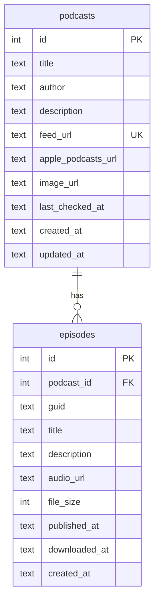
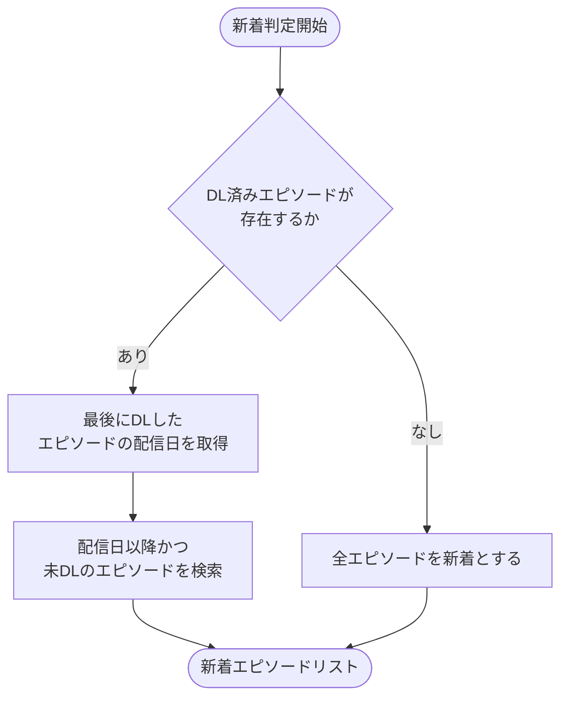
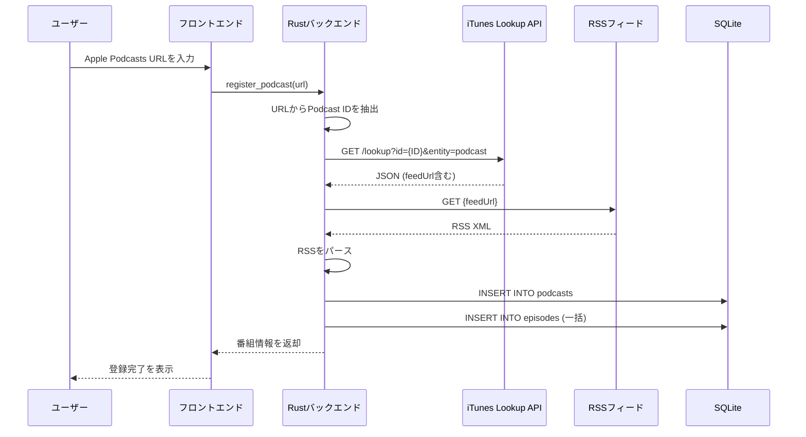
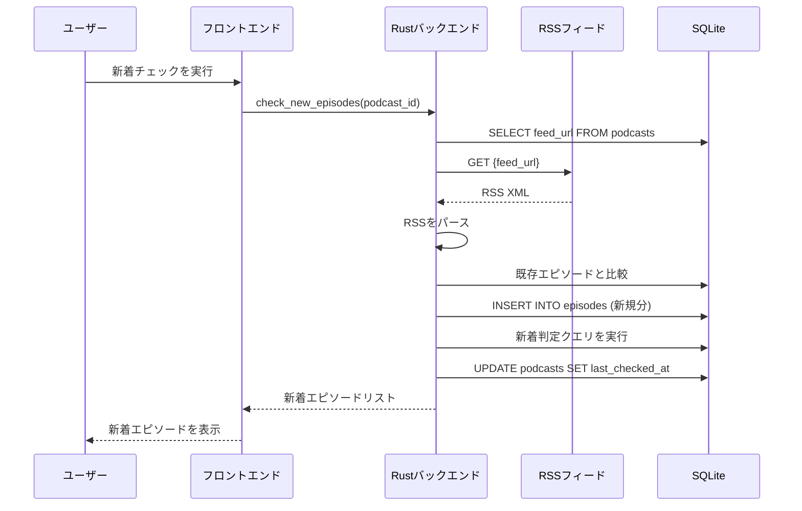
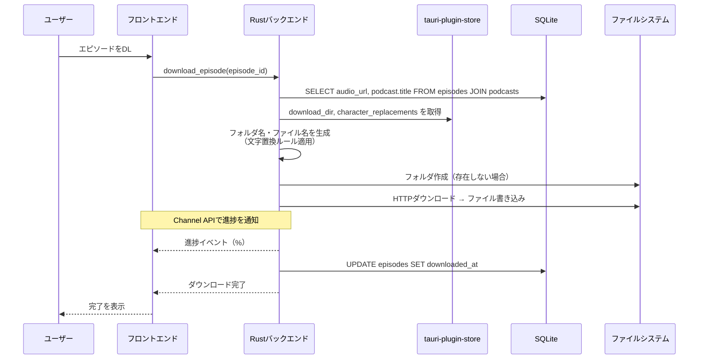

# データ設計書

## 1. 概要

データの保存先は2つに分かれる。

| 保存先 | 内容 | 形式 |
|--------|------|------|
| SQLite | 番組・エピソード情報 | リレーショナルデータ |
| JSON ファイル（tauri-plugin-store） | アプリケーション設定（DLフォルダ、文字置換ルール） | key-value |

## 2. SQLite — テーブル設計

### 2.1 ER 図



### 2.2 podcasts — 番組情報

| カラム名 | 型 | 制約 | 由来 | 説明 |
|---------|-----|------|------|------|
| id | INTEGER | PRIMARY KEY AUTOINCREMENT | アプリ | 番組 ID |
| title | TEXT | NOT NULL | RSS `<channel><title>` | 番組タイトル |
| author | TEXT | | iTunes `<itunes:author>` | 制作者名 |
| description | TEXT | | RSS `<channel><description>` | 番組の説明 |
| feed_url | TEXT | NOT NULL, UNIQUE | iTunes Lookup API `feedUrl` | RSS フィード URL |
| apple_podcasts_url | TEXT | | アプリ（ユーザー入力） | 元の Apple Podcasts Web ページ URL |
| image_url | TEXT | | iTunes `<itunes:image>` | アートワーク画像 URL |
| last_checked_at | TEXT | | アプリ | 最終新着チェック日時（ISO 8601） |
| created_at | TEXT | NOT NULL, DEFAULT CURRENT_TIMESTAMP | アプリ | レコード作成日時 |
| updated_at | TEXT | NOT NULL, DEFAULT CURRENT_TIMESTAMP | アプリ | レコード更新日時 |

### 2.3 episodes — エピソード情報

| カラム名 | 型 | 制約 | 由来 | 説明 |
|---------|-----|------|------|------|
| id | INTEGER | PRIMARY KEY AUTOINCREMENT | アプリ | エピソード ID |
| podcast_id | INTEGER | NOT NULL, FK → podcasts.id ON DELETE CASCADE | アプリ | 所属番組 |
| guid | TEXT | NOT NULL | RSS `<item><guid>` | エピソード固有識別子 |
| title | TEXT | NOT NULL | RSS `<item><title>` | エピソードタイトル |
| description | TEXT | | RSS `<item><description>` | エピソードの説明 |
| audio_url | TEXT | NOT NULL | RSS `<item><enclosure url>` | 音声ファイルの URL |
| file_size | INTEGER | | RSS `<item><enclosure length>` | ファイルサイズ（バイト） |
| published_at | TEXT | NOT NULL | RSS `<item><pubDate>` | 配信日時（ISO 8601） |
| downloaded_at | TEXT | | アプリ | DL完了日時（ISO 8601）。NULL = 未DL |
| created_at | TEXT | NOT NULL, DEFAULT CURRENT_TIMESTAMP | アプリ | レコード作成日時 |

**ユニーク制約**: UNIQUE(podcast_id, guid)

ダウンロード状態は `downloaded_at` カラムで管理する。`downloaded_at IS NOT NULL` であればダウンロード済み。再ダウンロード時は `downloaded_at` を更新する。ダウンロード先のファイルパスは設定とエピソード情報から計算可能なため保存しない。

### 2.4 インデックス

| インデックス名 | テーブル | カラム | 目的 |
|--------------|---------|--------|------|
| idx_episodes_podcast_published | episodes | (podcast_id, published_at) | 番組別のエピソード一覧取得・新着判定 |

### 2.5 日時の保存形式

SQLite に専用の日時型はないため、TEXT 型で ISO 8601 形式（例: `2026-02-22T10:30:00Z`）を使用する。ISO 8601 は文字列比較でも正しい時系列順になるため、新着判定の `published_at` 比較にそのまま使える。

## 3. SQLite — データベース設定

### 3.1 ファイル配置

SQLite データベースファイルは Tauri の `app_data_dir` に配置する。

| OS | パス |
|----|------|
| Windows | `C:\Users\{user}\AppData\Roaming\podcast-downloader\podcast-downloader.db` |
| macOS | `~/Library/Application Support/podcast-downloader/podcast-downloader.db` |

アプリ初回起動時にディレクトリとデータベースファイルを自動作成する。

### 3.2 接続時の設定

DB 接続時に以下の PRAGMA を実行する。

```sql
PRAGMA foreign_keys = ON;
```

SQLite は外部キー制約がデフォルト無効のため、これを有効にしないと ON DELETE CASCADE が機能しない。

### 3.3 マイグレーション

**rusqlite_migration** クレートを使用し、SQLite の `user_version` プラグマでスキーマバージョンを管理する。

```rust
use rusqlite_migration::{Migrations, M};

const MIGRATIONS: Migrations<'_> = Migrations::from_slice(&[
    M::up(include_str!("../migrations/001_initial.sql")),
    M::up(include_str!("../migrations/002_drop_duration.sql")),
]);
```

**初期マイグレーション (001_initial.sql)**:

```sql
CREATE TABLE podcasts (
    id INTEGER PRIMARY KEY AUTOINCREMENT,
    title TEXT NOT NULL,
    author TEXT,
    description TEXT,
    feed_url TEXT NOT NULL UNIQUE,
    apple_podcasts_url TEXT,
    image_url TEXT,
    last_checked_at TEXT,
    created_at TEXT NOT NULL DEFAULT (datetime('now')),
    updated_at TEXT NOT NULL DEFAULT (datetime('now'))
);

CREATE TABLE episodes (
    id INTEGER PRIMARY KEY AUTOINCREMENT,
    podcast_id INTEGER NOT NULL,
    guid TEXT NOT NULL,
    title TEXT NOT NULL,
    description TEXT,
    audio_url TEXT NOT NULL,
    file_size INTEGER,
    published_at TEXT NOT NULL,
    downloaded_at TEXT,
    created_at TEXT NOT NULL DEFAULT (datetime('now')),
    FOREIGN KEY (podcast_id) REFERENCES podcasts(id) ON DELETE CASCADE,
    UNIQUE(podcast_id, guid)
);

CREATE INDEX idx_episodes_podcast_published ON episodes(podcast_id, published_at);
```

## 4. アプリケーション設定（JSON）

アプリケーション設定は `tauri-plugin-store` を使用して JSON ファイルで管理する。

- 保存先: `$APPDATA/podcast-downloader/settings.json`

### 4.1 スキーマ

```json
{
  "download_dir": "C:\\Users\\user\\Podcasts",
  "character_replacements": [
    { "before": "/", "after": "-" },
    { "before": ":", "after": "-" }
  ],
  "fallback_replacement": "_"
}
```

| キー | 型 | 説明 |
|------|-----|------|
| `download_dir` | string | ダウンロード先ベースフォルダのパス |
| `character_replacements` | array | 文字置換ルールの配列。配列の順序が適用順序となる |
| `character_replacements[].before` | string | 置換前の文字列 |
| `character_replacements[].after` | string | 置換後の文字列 |
| `fallback_replacement` | string | 個別ルールに該当しない OS 禁止文字に対する一括置換文字 |

### 4.2 デフォルト値

初回起動時、設定ファイルが存在しない場合は以下のデフォルト値で作成する。

| キー | デフォルト値 | 備考 |
|------|-------------|------|
| `download_dir` | （未設定） | 初回DL時にフォルダ選択ダイアログで設定を促す |
| `character_replacements` | `[{"before":"/","after":"-"},{"before":":","after":"-"}]` | 下記「個別ルールの選定基準」参照 |
| `fallback_replacement` | `"_"` | 個別ルールに該当しない禁止文字の置換先 |

`download_dir` が未設定の状態でダウンロードを実行した場合は、フォルダ選択ダイアログを表示してユーザーに設定を促す。

#### 個別ルールの選定基準（ADR-015）

`character_replacements` に個別ルールを設定する文字は、`fallback_replacement` (`_`) では可読性が著しく低下するものに限定する。

| 文字 | after | 理由 |
|------|-------|------|
| `/` | `-` | 日付表記 `2024/01/15` → `2024-01-15` の可読性維持 |
| `:` | `-` | ラベル区切り・時刻表記ともに `-` で許容範囲 |

上記以外の Windows 禁止文字（`?` `"` `<` `>` `|`）は `fallback_replacement` による一括置換に委任する。これにより設定画面の一覧が簡潔になり、単語境界も `_` で保たれる。

## 5. 新着判定ロジック

### 5.1 判定フロー



### 5.2 SQL クエリ例

**新着エピソードの取得（DL 履歴あり）**:

```sql
SELECT e.*
FROM episodes e
WHERE e.podcast_id = ?
  AND e.published_at >= (
    SELECT e2.published_at
    FROM episodes e2
    WHERE e2.podcast_id = ?
      AND e2.downloaded_at IS NOT NULL
    ORDER BY e2.published_at DESC
    LIMIT 1
  )
  AND e.downloaded_at IS NULL
ORDER BY e.published_at ASC;
```

**新着エピソードの取得（DL 履歴なし — 全エピソードが新着）**:

```sql
SELECT e.*
FROM episodes e
WHERE e.podcast_id = ?
  AND e.downloaded_at IS NULL
ORDER BY e.published_at ASC;
```

## 6. データフロー

### 6.1 番組登録時



### 6.2 新着チェック時



### 6.3 ダウンロード時


