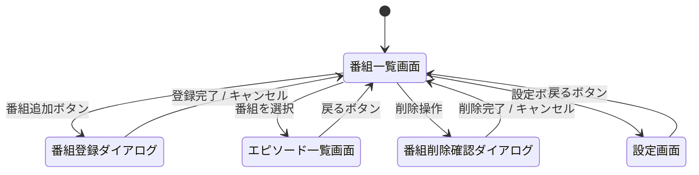
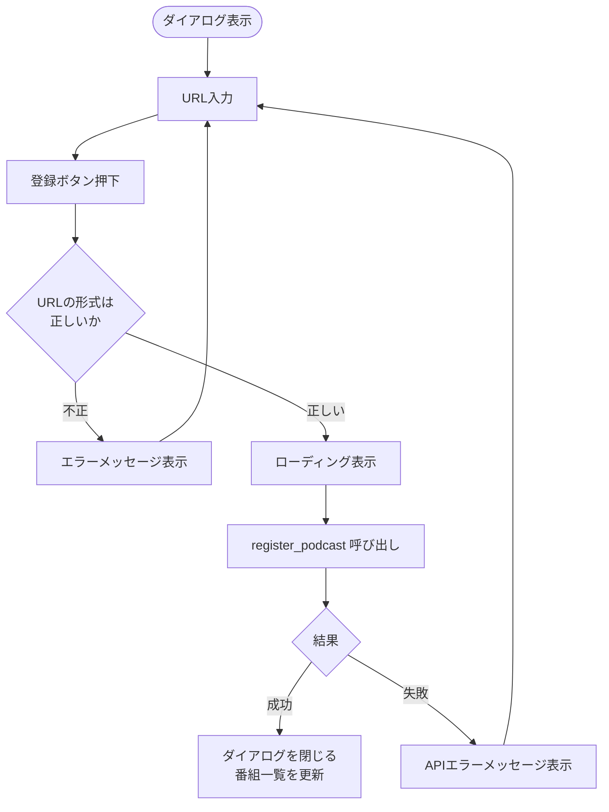
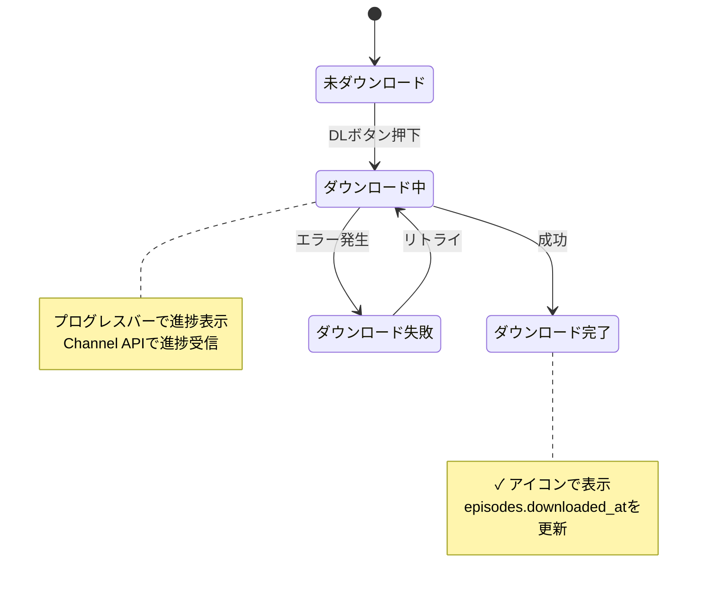
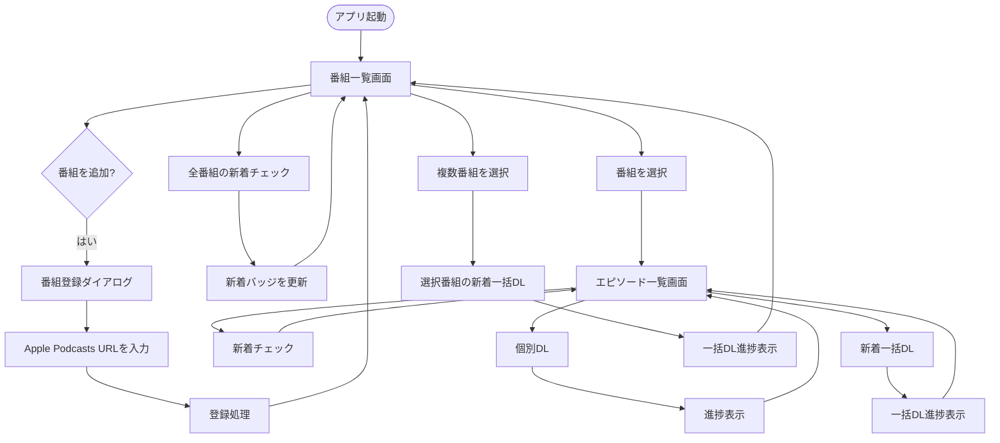
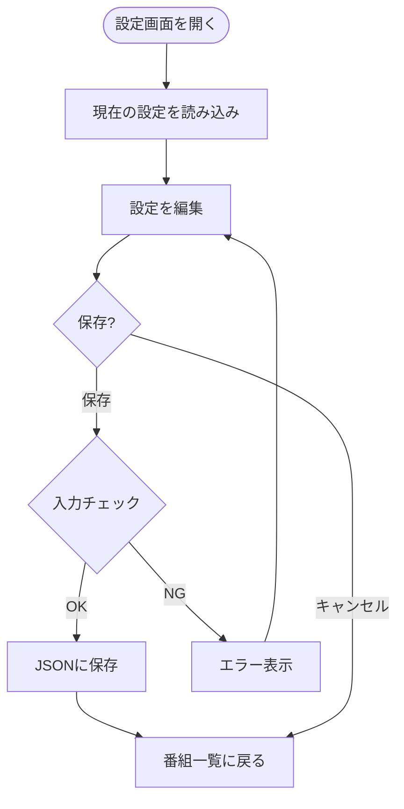

# 画面設計書

## 1. 画面一覧

| 画面 ID | 画面名 | パス | 説明 |
|--------|--------|------|------|
| SCR-001 | 番組一覧画面 | `/` | メイン画面。登録済み番組の一覧表示 |
| SCR-002 | エピソード一覧画面 | `/podcast/:id` | 番組のエピソード一覧・DL操作 |
| SCR-003 | 設定画面 | `/settings` | DLフォルダ、文字置換ルールの設定 |
| DLG-001 | 番組登録ダイアログ | （モーダル） | Apple Podcasts URL の入力・登録 |
| DLG-002 | 番組削除確認ダイアログ | （モーダル） | 番組削除の確認 |

## 2. 画面遷移図



## 3. 共通レイアウト

### 3.1 レイアウト構成

```
┌─────────────────────────────────────────────┐
│  ヘッダー                                     │
│  [アプリ名]              [新着チェック] [設定]  │
├─────────────────────────────────────────────┤
│                                             │
│  メインコンテンツ領域                          │
│  （各画面の内容がここに表示される）              │
│                                             │
│                                             │
│                                             │
│                                             │
├─────────────────────────────────────────────┤
│  ステータスバー（DL進捗等）                    │
└─────────────────────────────────────────────┘
```

### 3.2 共通コンポーネント

| コンポーネント | 説明 |
|--------------|------|
| Header | アプリ名、グローバル操作ボタン（全番組新着チェック、設定） |
| StatusBar | ダウンロード進捗およびエラーメッセージの表示。エラー発生時はステータスバーにエラー内容を表示する |
| LoadingSpinner | データ取得中のローディング表示 |
| ErrorMessage | エラー発生時のメッセージ表示 |
| ConfirmDialog | 確認ダイアログ（削除等） |
| Badge | 新着数バッジ |

## 4. 各画面の詳細設計

### 4.1 SCR-001: 番組一覧画面（メイン画面）

#### レイアウト

```
┌─────────────────────────────────────────────┐
│  Podcast Downloader      [全新着チェック] [⚙]  │
├─────────────────────────────────────────────┤
│                                             │
│  [+ 番組を追加]        [選択した番組の新着をDL] │
│                                             │
│  ┌─────────────────────────────────────────┐│
│  │ □ 🎨 番組タイトル A              🔴 3  ││
│  │     制作者名                           ││
│  │                              [🗑 削除] ││
│  ├─────────────────────────────────────────┤│
│  │ □ 🎨 番組タイトル B                    ││
│  │     制作者名                           ││
│  │                              [🗑 削除] ││
│  ├─────────────────────────────────────────┤│
│  │ □ 🎨 番組タイトル C              🔴 1  ││
│  │     制作者名                           ││
│  │                              [🗑 削除] ││
│  └─────────────────────────────────────────┘│
│                                             │
├─────────────────────────────────────────────┤
│  ステータスバー                               │
└─────────────────────────────────────────────┘
```

#### 表示要素

| 要素 | 説明 |
|------|------|
| アートワーク | 番組の画像（サムネイル表示） |
| 番組タイトル | 番組名。クリックでエピソード一覧画面へ遷移 |
| 制作者名 | 番組の制作者 |
| 新着バッジ | 新着エピソード数を数字で表示。新着がない場合は非表示 |
| チェックボックス | 複数番組選択用（一括DL対象の選択） |
| 削除ボタン | 番組削除（確認ダイアログを表示） |

#### 操作

| 操作 | 動作 |
|------|------|
| 「番組を追加」ボタン | 番組登録ダイアログを表示 |
| 番組タイトルをクリック | エピソード一覧画面へ遷移 |
| 「全新着チェック」ボタン | 全番組の RSS を再取得し新着を判定 |
| 「選択した番組の新着をDL」ボタン | チェックした番組の新着エピソードを一括DL |
| 削除ボタン | 削除確認ダイアログを表示 |
| ⚙ ボタン | 設定画面へ遷移 |

### 4.2 DLG-001: 番組登録ダイアログ

#### レイアウト

```
┌──────────────────────────────────┐
│  番組を登録                       │
│                                  │
│  Apple Podcasts URL:             │
│  ┌──────────────────────────────┐│
│  │ https://podcasts.apple.com/...││
│  └──────────────────────────────┘│
│                                  │
│  （登録処理中はスピナーを表示）      │
│  （エラー時はメッセージを表示）      │
│                                  │
│          [キャンセル]  [登録]      │
└──────────────────────────────────┘
```

#### 登録フロー



#### バリデーション

- URL が `https://podcasts.apple.com/` で始まること
- URL に Podcast ID（数字）が含まれること

### 4.3 SCR-002: エピソード一覧画面

#### レイアウト

```
┌─────────────────────────────────────────────┐
│  [← 戻る]  Podcast Downloader          [⚙]  │
├─────────────────────────────────────────────┤
│                                             │
│  🎨 番組タイトル                              │
│  制作者名                                    │
│  [新着をチェック]  [新着を一括DL]               │
│                                             │
│  ┌─────────────────────────────────────────┐│
│  │ エピソードタイトル 1                      ││
│  │   2026-02-20                     [DL]  ││
│  ├─────────────────────────────────────────┤│
│  │ エピソードタイトル 2                      ││
│  │   2026-02-18                     [DL]  ││
│  ├─────────────────────────────────────────┤│
│  │ ✓ エピソードタイトル 3  (DL済み)          ││
│  │   2026-02-15                           ││
│  ├─────────────────────────────────────────┤│
│  │ エピソードタイトル 4                      ││
│  │   2026-02-10                     [DL]  ││
│  └─────────────────────────────────────────┘│
│                                             │
├─────────────────────────────────────────────┤
│  DL中: エピソードタイトル 1  ████████░░ 80%   │
└─────────────────────────────────────────────┘
```

エピソードは配信日降順のフラットなリストで表示する。セクション分け（新着/過去）は行わない。各 EpisodeCard の DL 状態アイコンで未DL/DL済みを区別できるため、セクション分けは不要と判断した（ADR-016）。

#### 表示要素

| 要素 | 説明 |
|------|------|
| 番組情報ヘッダー | アートワーク、タイトル、制作者名 |
| エピソードタイトル | エピソード名 |
| 配信日 | エピソードの配信日 |
| DL 状態アイコン | ✓ DL済み（緑チェック）/ 未DL はアイコンなし |
| DL ボタン | エピソードの個別ダウンロードボタン（DL 済みでも再ダウンロード可能） |

#### 操作

| 操作 | 動作 |
|------|------|
| 「← 戻る」 | 番組一覧画面に戻る |
| 「新着をチェック」 | RSS を再取得し新着を判定 |
| 「新着を一括DL」 | 新着エピソードを全てダウンロード |
| エピソードの「DL」ボタン | 個別エピソードをダウンロード |

### 4.4 ダウンロード状態遷移



### 4.5 SCR-003: 設定画面

#### レイアウト

```
┌─────────────────────────────────────────────┐
│  [← 戻る]  設定                              │
├─────────────────────────────────────────────┤
│                                             │
│  ■ ダウンロードフォルダ                       │
│  ┌─────────────────────────────────┐        │
│  │ C:\Users\user\Podcasts          │ [選択] │
│  └─────────────────────────────────┘        │
│                                             │
│  ■ ファイル名・フォルダ名の文字置換ルール       │
│                                             │
│  個別置換ルール:                              │
│  ┌──────────┬──────────┬────────┐           │
│  │ 置換前    │ 置換後    │ 操作   │           │
│  ├──────────┼──────────┼────────┤           │
│  │ /        │ -        │ [🗑]   │           │
│  ├──────────┼──────────┼────────┤           │
│  │ :        │ -        │ [🗑]   │           │
│  └──────────┴──────────┴────────┘           │
│  [+ ルールを追加]                             │
│                                             │
│  フォールバック置換:                           │
│  上記ルールに該当しない禁止文字の置換先:         │
│  ┌──────────┐                               │
│  │ _        │                               │
│  └──────────┘                               │
│                                             │
│                    [キャンセル]  [保存]        │
│                                             │
├─────────────────────────────────────────────┤
│  ステータスバー                               │
└─────────────────────────────────────────────┘
```

#### 操作

| 操作 | 動作 |
|------|------|
| フォルダ「選択」ボタン | OS のフォルダ選択ダイアログを表示 |
| 「ルールを追加」 | 置換ルール行を追加 |
| 🗑 ボタン | 置換ルール行を削除 |
| 「保存」ボタン | 設定を保存（tauri-plugin-store） |
| 「キャンセル」ボタン | 変更を破棄して番組一覧に戻る |

## 5. 操作フロー

### 5.1 番組登録から新着 DL までの全体フロー



### 5.2 設定変更フロー



## 6. UI フレームワーク・スタイリング

- **CSS フレームワーク**: Tailwind CSS
- **コンポーネントライブラリ**: shadcn/ui（Radix UI ベース）

shadcn/ui はコピー＆ペースト方式のコンポーネント集で、ダイアログ、ボタン、テーブル、バッジなど本アプリで必要な UI 部品が揃っている。
