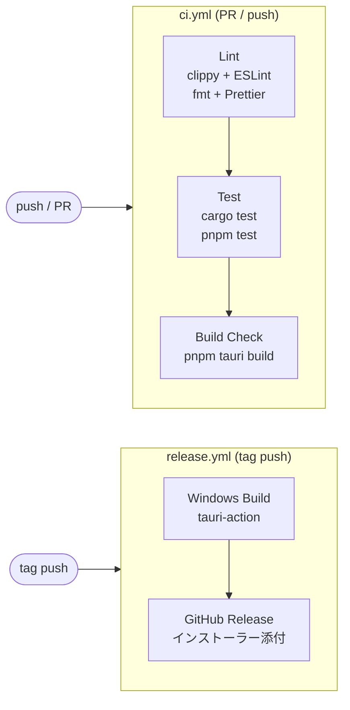

# 開発ガイド

## 1. 開発環境構築

### 1.1 前提条件

| ツール | 用途 | インストール方法 |
|-------|------|----------------|
| Homebrew | macOS パッケージマネージャー | [brew.sh](https://brew.sh/) |
| mise | ランタイムバージョン管理 | `brew install mise` |
| Rust (rustup) | Rust ツールチェイン | 下記参照 |
| Node.js | フロントエンドビルド | mise 経由 |
| pnpm | Node.js パッケージマネージャー | mise 経由 |

### 1.2 セットアップ手順

#### 1. mise のインストールと設定

```bash
brew install mise

# シェル設定に追加（zsh の場合）
echo 'eval "$(mise activate zsh)"' >> ~/.zshrc
source ~/.zshrc
```

#### 2. Rust のインストール

```bash
curl --proto '=https' --tlsv1.2 -sSf https://sh.rustup.rs | sh
source $HOME/.cargo/env

# インストール確認
rustc --version
cargo --version
```

#### 3. プロジェクトのクローンと依存関係インストール

```bash
git clone <repository-url>
cd podcast-downloader

# mise が .mise.toml を読んで Node.js をインストール
mise install

# pnpm のインストール（未インストールの場合）
mise use -g pnpm

# フロントエンド依存関係のインストール
pnpm install
```

#### 4. Tauri プラグインの追加

```bash
cd src-tauri

# tauri-plugin-store: アプリケーション設定の JSON 保存
cargo add tauri-plugin-store

# tauri-plugin-dialog: フォルダ選択ダイアログ
cargo add tauri-plugin-dialog
```

`src-tauri/src/lib.rs` でプラグインを登録する:

```rust
tauri::Builder::default()
    .plugin(tauri_plugin_store::Builder::new().build())
    .plugin(tauri_plugin_dialog::init())
    // ...
    .run(tauri::generate_context!())
    .expect("error while running tauri application");
```

#### 5. 動作確認

```bash
# 開発サーバー起動（macOS 版）
pnpm tauri dev
```

### 1.3 .mise.toml

プロジェクトルートに配置する `.mise.toml` で Node.js バージョンを固定する。

```toml
[tools]
node = "24"     # LTS バージョンを指定
```

### 1.4 .node-version

CI の `actions/setup-node` は `.mise.toml` を直接読めないため、`.node-version` ファイルもプロジェクトルートに配置する。

```
24
```

ローカル開発では mise が `.mise.toml` を参照し、CI では `actions/setup-node` が `.node-version` を参照する。

## 2. 開発コマンド一覧

### 2.1 開発・ビルド

| コマンド | 説明 |
|---------|------|
| `pnpm tauri dev` | 開発サーバー起動（ホットリロード対応） |
| `pnpm tauri build` | プロダクションビルド（ローカル OS 向け） |
| `pnpm dev` | フロントエンドのみの開発サーバー起動 |
| `pnpm build` | フロントエンドのみのビルド |

### 2.2 テスト

| コマンド | 説明 |
|---------|------|
| `cargo test` | Rust バックエンドの全テスト実行 |
| `cargo test -- --nocapture` | テスト出力を表示しながら実行 |
| `pnpm test` | フロントエンドの全テスト実行 |
| `pnpm test:watch` | フロントエンドテストをウォッチモードで実行 |

### 2.3 Lint・フォーマット

| コマンド | 説明 |
|---------|------|
| `cargo clippy` | Rust の静的解析 |
| `cargo clippy -- -D warnings` | 警告をエラーとして扱う（CI 相当） |
| `cargo fmt --check` | Rust のフォーマットチェック |
| `cargo fmt` | Rust のフォーマット実行 |
| `pnpm lint` | TypeScript/React の ESLint 実行 |
| `pnpm lint:fix` | ESLint の自動修正 |
| `pnpm format:check` | Prettier のフォーマットチェック |
| `pnpm format` | Prettier のフォーマット実行 |

### 2.4 ローカルで CI 相当を実行

CI と同じ検証をローカルで実行するためのコマンド:

```bash
# Lint（Rust + TypeScript）
cargo clippy -- -D warnings && cargo fmt --check && pnpm lint && pnpm format:check

# テスト（Rust + TypeScript）
cargo test && pnpm test

# ビルド確認
pnpm tauri build
```

## 3. テスト方針

テストフレームワークの詳細な選定は実装フェーズで決定する。以下は現時点の方針。

### 3.1 Rust バックエンドテスト

#### 単体テスト

- 各モジュール内に `#[cfg(test)]` で定義する
- ビジネスロジック（services/）を中心にテストを記述する
- 外部 API（iTunes、RSS）は trait を使ったモック化を検討

#### DB テスト

- **インメモリ SQLite** (`":memory:"`) を使用してテストする
- テストごとにマイグレーションを実行し、クリーンな状態でテストする

```rust
#[cfg(test)]
mod tests {
    use rusqlite::Connection;

    fn setup_test_db() -> Connection {
        let conn = Connection::open_in_memory().unwrap();
        // マイグレーション実行
        MIGRATIONS.to_latest(&mut conn).unwrap();
        conn
    }

    #[test]
    fn test_insert_podcast() {
        let conn = setup_test_db();
        // テスト実装
    }
}
```

#### テスト対象の優先度

1. **services/filename.rs** — 文字置換ロジック（OS 禁止文字の処理）
2. **services/apple_podcasts.rs** — URL からの Podcast ID 抽出
3. **db/podcast.rs, db/episode.rs** — CRUD 操作、新着判定クエリ、ダウンロード状態更新
4. **services/rss.rs** — RSS パース処理

### 3.2 フロントエンドテスト

#### テストフレームワーク（候補）

- **Vitest** — テストランナー（Vite との親和性が高い）
- **Testing Library** — コンポーネントテスト

#### Tauri invoke のモック

フロントエンドテストでは Tauri の `invoke` をモックする必要がある。

```typescript
// テストユーティリティ例
vi.mock("@tauri-apps/api/core", () => ({
  invoke: vi.fn(),
}));
```

## 4. Lint・フォーマット設定

### 4.1 Rust

- **clippy**: Rust 標準の Linter。`cargo clippy` で実行
- **rustfmt**: Rust 標準のフォーマッター。`cargo fmt` で実行
- 設定ファイル: `rustfmt.toml`（必要に応じてカスタマイズ）

### 4.2 TypeScript / React

- **ESLint**: JavaScript/TypeScript の静的解析
- **Prettier**: コードフォーマッター
- 設定ファイル: `.eslintrc.cjs` / `.prettierrc`（実装時に作成）

## 5. CI/CD 設計

### 5.1 パイプライン概要



### 5.2 ci.yml — Lint・テスト・ビルドチェック

**トリガー**: プルリクエスト、main ブランチへの push

```yaml
name: CI

on:
  push:
    branches: [main]
  pull_request:
    branches: [main]

jobs:
  lint-and-test:
    runs-on: ubuntu-latest  # Lint・テストはLinuxで十分
    steps:
      - uses: actions/checkout@v4

      - name: Setup Rust
        uses: dtolnay/rust-toolchain@stable
        with:
          components: clippy, rustfmt

      - name: Install system dependencies (Ubuntu)
        run: |
          sudo apt-get update
          sudo apt-get install -y libwebkit2gtk-4.1-dev libappindicator3-dev librsvg2-dev patchelf

      - name: Setup Node.js
        uses: actions/setup-node@v4
        with:
          node-version-file: '.node-version'

      - name: Install pnpm
        uses: pnpm/action-setup@v4

      - name: Install dependencies
        run: pnpm install

      # Rust Lint
      - name: Cargo clippy
        run: cargo clippy --manifest-path src-tauri/Cargo.toml -- -D warnings

      - name: Cargo fmt check
        run: cargo fmt --manifest-path src-tauri/Cargo.toml --check

      # TypeScript Lint
      - name: ESLint
        run: pnpm lint

      - name: Prettier check
        run: pnpm format:check

      # Tests
      - name: Cargo test
        run: cargo test --manifest-path src-tauri/Cargo.toml

      - name: Frontend test
        run: pnpm test
```

### 5.3 release.yml — ビルド・リリース

**トリガー**: `v*` パターンのタグ push

```yaml
name: Release

on:
  push:
    tags:
      - 'v*'

jobs:
  release:
    permissions:
      contents: write
    strategy:
      matrix:
        include:
          - platform: windows-latest
            args: ''
          # 将来的に macOS / Linux を追加可能
          # - platform: macos-latest
          #   args: ''
    runs-on: ${{ matrix.platform }}
    steps:
      - uses: actions/checkout@v4

      - name: Setup Rust
        uses: dtolnay/rust-toolchain@stable

      - name: Setup Node.js
        uses: actions/setup-node@v4
        with:
          node-version-file: '.node-version'

      - name: Install pnpm
        uses: pnpm/action-setup@v4

      - name: Install dependencies
        run: pnpm install

      - name: Build and Release
        uses: tauri-apps/tauri-action@v0
        env:
          GITHUB_TOKEN: ${{ secrets.GITHUB_TOKEN }}
        with:
          tagName: ${{ github.ref_name }}
          releaseName: 'Podcast Downloader ${{ github.ref_name }}'
          releaseBody: 'See the assets to download this version.'
          releaseDraft: true
          prerelease: false
          args: ${{ matrix.args }}
```

## 6. リリース手順

### 6.1 バージョニング方針

Semantic Versioning (SemVer) に従う: `MAJOR.MINOR.PATCH`

- **MAJOR**: 互換性のない変更
- **MINOR**: 後方互換性のある機能追加
- **PATCH**: 後方互換性のあるバグ修正

### 6.2 リリース手順

1. `src-tauri/tauri.conf.json` の `version` を更新する
2. `package.json` の `version` を更新する（一致させる）
3. 変更をコミットする
4. バージョンタグを作成して push する

```bash
# バージョン更新をコミット
git add -A
git commit -m "chore: bump version to v0.1.0"

# タグを作成して push
git tag v0.1.0
git push origin main --tags
```

5. GitHub Actions の release.yml が自動実行される
6. GitHub Releases にドラフトリリースが作成される
7. ドラフトの内容を確認し、公開する

## 7. トラブルシューティング

### Tauri の開発サーバーが起動しない

- Rust ツールチェインが正しくインストールされているか確認: `rustc --version`
- macOS の場合、Xcode Command Line Tools が必要: `xcode-select --install`
- `src-tauri/` ディレクトリで `cargo build` が通るか個別に確認

### pnpm install でエラーが発生する

- Node.js のバージョンが `.mise.toml` で指定したバージョンと一致しているか確認: `node --version`
- `node_modules` を削除して再インストール: `rm -rf node_modules && pnpm install`

### CI でビルドが失敗する

- ローカルで CI 相当のコマンドを実行して再現を試みる（2.4 節参照）
- Rust の依存クレートのバージョン互換性を確認
- `pnpm-lock.yaml` が最新かどうか確認
